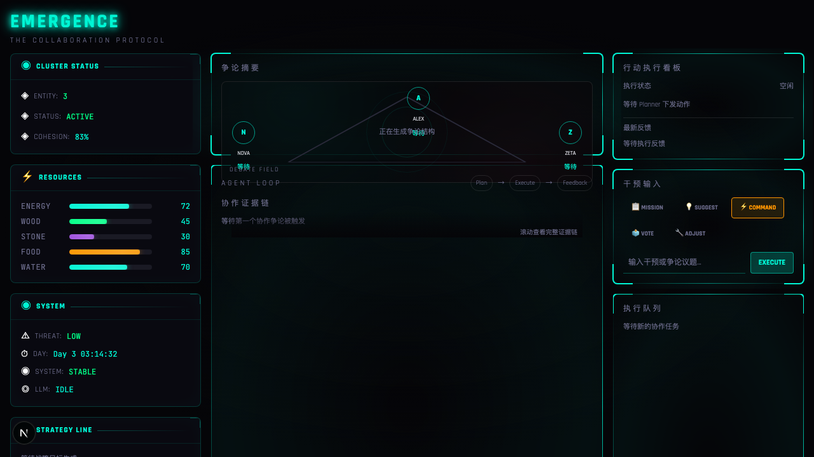

# Sprites Directory Guide



这个目录用于存放视觉资源（可选）。当前 `EMERGENCE` 主流程不依赖这些精灵文件，缺失时不会影响 Agent 系统运行。

## Current Status

- 运行路径：`/`（非 `/game`）
- 主要 UI：基于 CSS + Canvas + 组件渲染
- `public/sprites`：保留为后续主题扩展位

## Suggested Structure

```text
public/sprites/
  common/
    icons/
    badges/
  themes/
    colony/
      background/
      agents/
      items/
    wasteland/
      background/
      agents/
      items/
```

## Asset Rules

- 图片格式：优先 `png` / `webp`
- 命名：`kebab-case`，例如 `agent-builder-idle.png`
- 尺寸：同一批次保持统一网格，避免 UI 抖动
- 许可证：仅引入可商用资源，必须在 PR 说明来源

## Integration Checklist

- 新增素材后，先在本地跑 `npm run lint` 与 `npm run typecheck`
- 确认首页初始化、争论链、执行看板不受影响
- 弱网或资源缺失时，页面必须可降级渲染

## Notes

- 若后续接入动态图集（sprite atlas），建议新增 `manifest.json` 描述帧信息，避免硬编码。
- 若要做主题切换，可在 store 中增加 `themeId`，按世界观动态映射 `themes/*` 资源路径。
